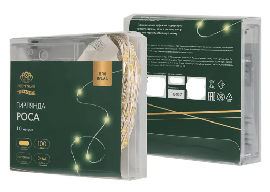
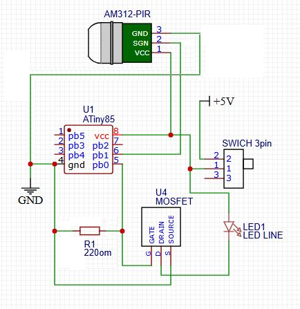

# Управление гирляндой по датчику движения.

Применимо для гирлянды с питанием 5В. Если гирлянда не имеет режимов работы, данная схема будет включать и выключать гирлянду по датчику движения. Пока Вас нет рядом, расход батарейки минимален.

Пример:

- https://ivanovo.lemanapro.ru/product/elektrogirlyanda-komnatnaya-neon-night-rosa-10-m-100-lamp-cvet-teplyy-belyy-1-rezhim-raboty-89435208/ 

# Комплектация: (~517р.)
- Электрогирлянда комнатная Neon-Night Роса 10 м 100 ламп (220р.)
- датчик движения (PIR) AM312 (94р.)
- резистор 220 Ом (5р.) 
- MOSFET IRLZ44N (35р.)
- ATiny 85-20PU DIP-8 (163р.)

# Схема соединения 

